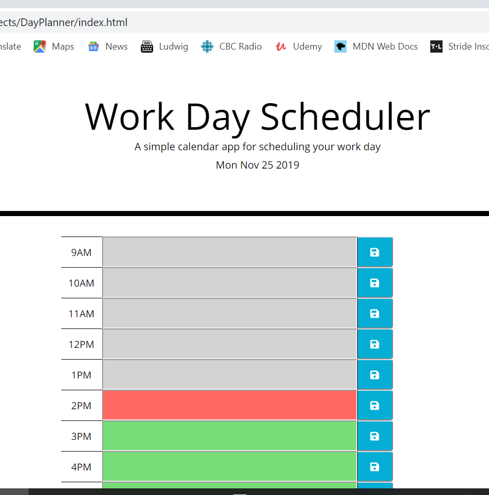
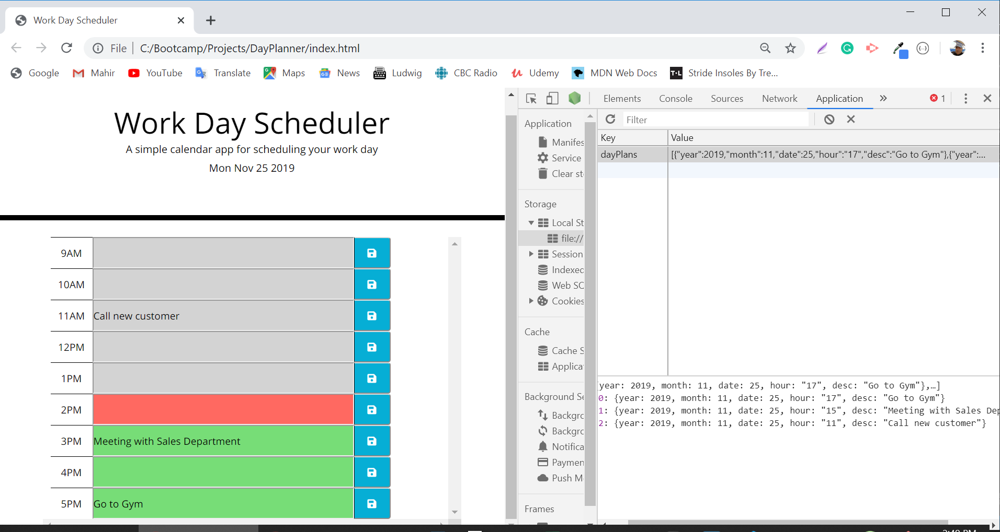

# Day Planner
###Homework 4

This app is about a work day planner. The container has from 9AM to 5PM time blocks which users can add their important events. The current day is displayed at the top of the calendar.
Time blocks (hour labels, input fields, and save buttons) are created dynamically.

Each timeblock contains an input field and save button.

Clicking a timeblock's "Save" button stores the input text in local storage, allowing the text to persist when the application is refreshed.
Additionally, each hour block is color coded to reflect whether the time block is in the past, the present, or the future. This changes automaticially, depending on the time of day.